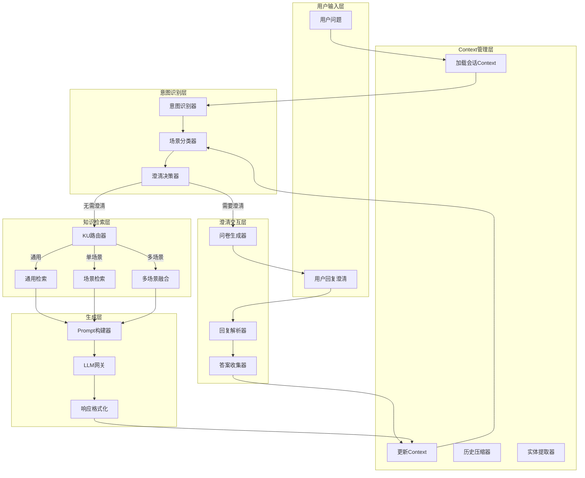
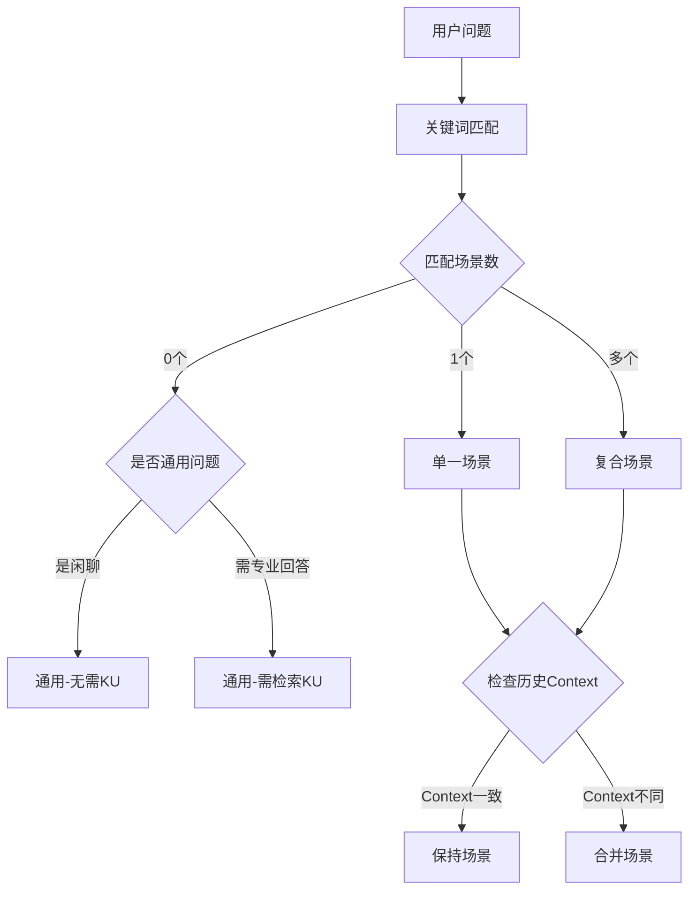

# 场景化知识问答系统完整设计

## 一、系统整体架构



---

## 二、核心模块设计

### 2.1 意图识别模块

**输入**: 用户问题 + 历史Context

**输出**: 意图类型 + 置信度 + 场景分类

#### 意图类型定义

| 意图类型 | 说明 | 典型问法 | 是否需要KU |

|---------|------|---------|-----------|

| solution_recommendation | 方案推荐 | "推荐一个XX方案" | 是 |

| technical_qa | 技术问答 | "XX怎么配置" | 是 |

| troubleshooting | 故障诊断 | "XX报错怎么办" | 是 |

| comparison | 对比分析 | "XX和YY有什么区别" | 是 |

| concept_explain | 概念解释 | "什么是XX" | 是 |

| best_practice | 最佳实践 | "XX有哪些最佳实践" | 是 |

| how_to | 操作指南 | "如何做XX" | 是 |

| general_chat | 闲聊/通用 | "你好"、"谢谢" | 否 |

#### 场景分类逻辑



---

### 2.2 澄清交互模块

#### 澄清触发条件

| 条件 | 说明 | 示例 |

|------|------|------|

| 场景模糊 | 匹配到多个场景，无法确定主场景 | "推荐一个安全方案"（网络安全？数据安全？） |

| 信息不足 | 方案推荐类缺少关键上下文 | "推荐一个AOI方案"（产品类型？预算？） |

| 问题过于宽泛 | 问题范围太大，无法给出精准回答 | "怎么做质量检测" |

| 首次交互 | 新用户首次提问复杂问题 | - |

#### Questionnaire 问题类型

| 问题类型 | 格式 | 适用场景 |

|---------|------|---------|

| single_choice | 单选（1-5选一） | 场景选择、规模选择 |

| multi_choice | 多选（可选多个） | 关注维度、需求特征 |

| text | 自由文本 | 补充描述、错误信息 |

| scale | 量表（1-5分） | 优先级评估 |

#### 澄清问题库设计

**按意图分类的标准问题：**

**方案推荐类 (solution_recommendation):**

1. 企业规模/团队规模
2. 预算范围
3. 技术能力水平
4. 实施时间要求
5. 核心痛点（开放式）

**故障诊断类 (troubleshooting):**

1. 具体错误信息/现象
2. 发生时间/频率
3. 最近的变更操作
4. 影响范围
5. 已尝试的解决方法

**对比分析类 (comparison):**

1. 关注的对比维度（成本/性能/易用性等）
2. 应用场景
3. 决策时间点

#### 问卷呈现格式

```

🤔 为了给您更精准的建议，请回答以下问题：

**问题1：您的产品类型是？** (必填，回复数字)

1. PCB/电路板
2. 电子元器件
3. 外观件/结构件
4. 其他（请说明）

**问题2：检测的核心需求是？** (可多选，回复数字如"1,