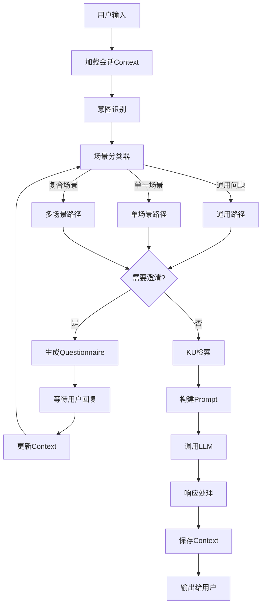

# 场景化知识问答系统架构设计

## 整体架构流程



---

## 1. 核心数据模型设计

### 1.1 会话Context模型

```python
# 新增文件: services/api/app/models/conversation.py
class ConversationContext:
    conversation_id: str
    user_id: str
    
    # 意图和场景状态
    current_intent: IntentType
    current_scenarios: List[str]      # 可能涉及多个场景
    scene_type: "general" | "single" | "multi"
    
    # 澄清状态
    clarification_state: ClarificationState
    pending_questions: List[Question]   # 待回答的问题
    collected_answers: Dict[str, Any]   # 已收集的答案
    
    # 对话历史摘要（用于长对话压缩）
    topic_summary: str                  # 当前话题摘要
    key_entities: List[str]             # 关键实体（公司名、产品名等）
    user_preferences: Dict[str, Any]    # 用户偏好（预算、技术水平等）
    
    # 原始历史（限制长度）
    messages: List[Message]             # 最近N轮对话
    max_history: int = 10
```

### 1.2 KU场景化索引模型

```python
# 修改 OpenSearch 索引 mapping
{
    "mappings": {
        "properties": {
            "title": {"type": "text", "analyzer": "ik_max_word"},
            "summary": {"type": "text", "analyzer": "ik_max_word"},
            "full_text": {"type": "text", "analyzer": "ik_max_word"},
            
            # 场景化字段（新增）
            "scenario_id": {"type": "keyword"},           # 主场景
            "scenario_tags": {"type": "keyword"},         # 场景标签（可多个）
            "solution_id": {"type": "keyword"},           # 所属解决方案
            "intent_types": {"type": "keyword"},          # 适用的意图类型
            "applicability_score": {"type": "float"},     # 通用性评分(0-1)
            
            # 材料元数据
            "material_type": {"type": "keyword"},
            "source_file": {"type": "keyword"},
            "terms": {"type": "keyword"},
            "key_points": {"type": "text"}
        }
    }
}
```

---

## 2. 意图识别与场景分类

### 2.1 增强的意图识别

修改 [`services/api/app/services/intent_scenario.py`](services/api/app/services/intent_scenario.py)：

```python
class EnhancedIntentResult:
    intent_type: IntentType
    confidence: float
    
    # 场景分类（新增）
    scene_type: Literal["general", "single", "multi"]
    matched_scenarios: List[str]        # 匹配的场景ID列表
    scenario_weights: Dict[str, float]  # 各场景权重
    
    # 澄清需求
    needs_clarification: bool
    clarification_reason: str
    suggested_questions: List[Question]
```

### 2.2 场景分类逻辑

```python
def classify_scene(query: str, intent: IntentResult, context: ConversationContext) -> SceneClassification:
    """
    判断问题类型：通用 / 单一场景 / 复合场景
    """
    # 1. 提取查询中的场景关键词
    matched_scenarios = match_scenarios_by_keywords(query)
    
    # 2. 结合历史Context
    if context and context.current_scenarios:
        # 延续之前的场景
        matched_scenarios = merge_scenarios(matched_scenarios, context.current_scenarios)
    
    # 3. 判断场景类型
    if len(matched_scenarios) == 0:
        # 检查是否完全通用（闲聊、通用技术问题）
        if is_general_question(query, intent):
            return SceneClassification(type="general", scenarios=[], use_ku=False)
        else:
            return SceneClassification(type="general", scenarios=[], use_ku=True)
    
    elif len(matched_scenarios) == 1:
        return SceneClassification(type="single", scenarios=matched_scenarios, use_ku=True)
    
    else:
        return SceneClassification(type="multi", scenarios=matched_scenarios, use_ku=True)
```

---

## 3. Questionnaire 澄清机制

### 3.1 问题生成器

新增文件 `services/api/app/services/clarification.py`：

```python
class ClarificationEngine:
    """
    多维度澄清问题生成器
    """
    
    def generate_questionnaire(
        self,
        query: str,
        intent: IntentType,
        scene_type: str,
        scenarios: List[str],
        context: ConversationContext
    ) -> Questionnaire:
        """
        根据意图和场景生成澄清问卷
        """
        questions = []
        
        # 1. 场景澄清（多场景时）
        if scene_type == "multi" and len(scenarios) > 1:
            questions.append(Question(
                id="scenario_focus",
                type="single_choice",
                text="您的问题主要涉及哪个领域？",
                options=[
                    {"id": s, "label": SCENARIO_NAMES[s]} for s in scenarios
                ],
                required=True
            ))
        
        # 2. 用户背景（首次或缺失时）
        if not context.user_preferences.get("company_size"):
            questions.append(Question(
                id="company_size",
                type="single_choice",
                text="您的企业规模？",
                options=[
                    {"id": "small", "label": "小型 (<100人)"},
                    {"id": "medium", "label": "中型 (100-1000人)"},
                    {"id": "large", "label": "大型 (>1000人)"}
                ]
            ))
        
        # 3. 意图特定问题
        if intent == IntentType.SOLUTION_RECOMMENDATION:
            if not context.collected_answers.get("budget"):
                questions.append(Question(
                    id="budget",
                    type="single_choice",
                    text="您的预算范围？",
                    options=[
                        {"id": "low", "label": "有限 (优先考虑成本)"},
                        {"id": "medium", "label": "中等 (平衡性价比)"},
                        {"id": "high", "label": "充足 (优先考虑效果)"}
                    ]
                ))
            
            if not context.collected_answers.get("timeline"):
                questions.append(Question(
                    id="timeline",
                    type="single_choice",
                    text="期望的实施周期？",
                    options=[
                        {"id": "urgent", "label": "紧急 (1个月内)"},
                        {"id": "normal", "label": "正常 (1-3个月)"},
                        {"id": "flexible", "label": "灵活 (3个月以上)"}
                    ]
                ))
        
        elif intent == IntentType.TROUBLESHOOTING:
            questions.append(Question(
                id="symptom",
                type="text",
                text="请描述具体的问题现象（错误信息、异常表现等）",
                required=True
            ))
        
        # 4. 开放式补充
        questions.append(Question(
            id="additional_context",
            type="text",
            text="还有其他需要补充的信息吗？（可选）",
            required=False
        ))
        
        return Questionnaire(
            id=str(uuid.uuid4()),
            questions=questions[:5],  # 限制最多5个问题
            context_summary=self._summarize_context(context)
        )
```

### 3.2 问卷响应解析

```python
def parse_user_response(user_input: str, pending_questionnaire: Questionnaire) -> Dict[str, Any]:
    """
    解析用户对问卷的回复（支持多种格式）
    """
    answers = {}
    
    # 1. 数字选择模式 ("1" 或 "1,3,4")
    if re.match(r'^[\d,\s]+$', user_input.strip()):
        numbers = [int(n.strip()) for n in user_input.split(',')]
        for i, q in enumerate(pending_questionnaire.questions):
            if i + 1 in numbers and q.options:
                answers[q.id] = q.options[0]["id"]  # 简化处理
    
    # 2. 关键词提取模式
    else:
        # 使用LLM提取结构化信息
        answers = extract_answers_with_llm(user_input, pending_questionnaire)
    
    return answers
```

---

## 4. Context管理与一致性保证

### 4.1 Context压缩与摘要

```python
class ContextManager:
    """
    管理多轮对话的Context，保证一致性
    """
    
    def update_context(
        self,
        context: ConversationContext,
        user_message: str,
        assistant_response: str,
        extracted_info: Dict
    ) -> ConversationContext:
        """
        更新对话Context
        """
        # 1. 添加新消息
        context.messages.append(Message(role="user", content=user_message))
        context.messages.append(Message(role="assistant", content=assistant_response))
        
        # 2. 压缩历史（超过max_history时）
        if len(context.messages) > context.max_history * 2:
            # 保留最新消息，压缩旧消息为摘要
            old_messages = context.messages[:-context.max_history]
            context.topic_summary = self._compress_to_summary(
                old_messages, context.topic_summary
            )
            context.messages = context.messages[-context.max_history:]
        
        # 3. 更新关键实体
        new_entities = self._extract_entities(user_message + assistant_response)
        context.key_entities = list(set(context.key_entities + new_entities))[:20]
        
        # 4. 更新用户偏好
        if extracted_info:
            context.user_preferences.update(extracted_info)
            context.collected_answers.update(extracted_info)
        
        return context
    
    def build_context_prompt(self, context: ConversationContext) -> str:
        """
        构建注入到Prompt的Context信息
        """
        parts = []
        
        # 历史摘要
        if context.topic_summary:
            parts.append(f"【对话背景】\n{context.topic_summary}")
        
        # 用户信息
        if context.user_preferences:
            prefs = "\n".join([f"- {k}: {v}" for k, v in context.user_preferences.items()])
            parts.append(f"【用户信息】\n{prefs}")
        
        # 关键实体
        if context.key_entities:
            parts.append(f"【相关实体】{', '.join(context.key_entities)}")
        
        # 当前场景
        if context.current_scenarios:
            parts.append(f"【当前场景】{', '.join(context.current_scenarios)}")
        
        return "\n\n".join(parts)
```

---

## 5. 场景化KU检索

### 5.1 分层检索策略

修改 [`services/api/app/services/retrieval.py`](services/api/app/services/retrieval.py)：

```python

def search_with_scenario(

query: str,

scene_type: str,

scenarios: List[str],

intent: IntentType,

context: ConversationContext,

top_k: int = 5

) -> List[KUHit]:

"""

场景化KU检索

"""

if scene_type == "general" and not scenarios:

# 通用问题：检索高通用性KU或不检索

return search_general(query, top_k)

elif scene_type == "single":

# 单场景：只检索该场景的KU

return search_single_scenario(query, scenarios[0], intent, top_k)

else:

# 多场景：加权检索多个场景

return search_multi_scenario(query, scenarios, intent, top_k)

def search_single_scenario(query: str, scenario_id: str, intent: IntentType, top_k: int) -> List[KUHit]:

"""

单场景检索：场景过滤 + 意图匹配

"""

body = {

"query": {

"bool": {

"must": [

{"simple_query_string": {

"query": query,

"fields": ["title^3", "summary^2", "full_text"]

}}

],

"filter": [

{"term": {"scenario_id": scenario_id}}

],

"should": [

{"term": {"intent_types": intent.value}}  # 意图匹配加分

]

}

},

"size": top_k

}

return execute_search(body)

def search_multi_scenario(query: str, scenarios: List[str], intent: IntentType, top_k: int) -> List[KUHit]:

"""

多场景检索：每个场景检索后融合

"""

all_hits = []

per_scenario_k = max(2, top_k // len(scenarios))

for scenario_id in scenarios:

hits = search_single_scenario(query, scenario_id, intent, per_scenario_k)

for h in hits:

h["matched_scenario"] = scenario_id

all_hits.extend(hits)

# 按分数排序，去