# AI Data Factory (single-VM, docker-compose)

一站式 AI 数据工厂：文档处理 → 知识提取 → RAG 对话

---

## 📋 目录

- [系统架构](#-系统架构)
- [用户角色与旅程](#-用户角色与旅程)
- [一键部署](#-一键部署-阿里云-ecs)
- [服务访问](#-服务访问地址)
- [Make 命令](#-make-命令)
- [更多文档](#-更多文档)

---

## 🏗️ 系统架构

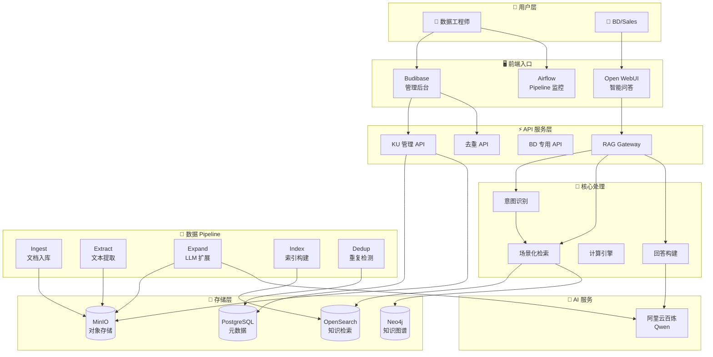

---

## 👥 用户角色与旅程

### 角色职责概览

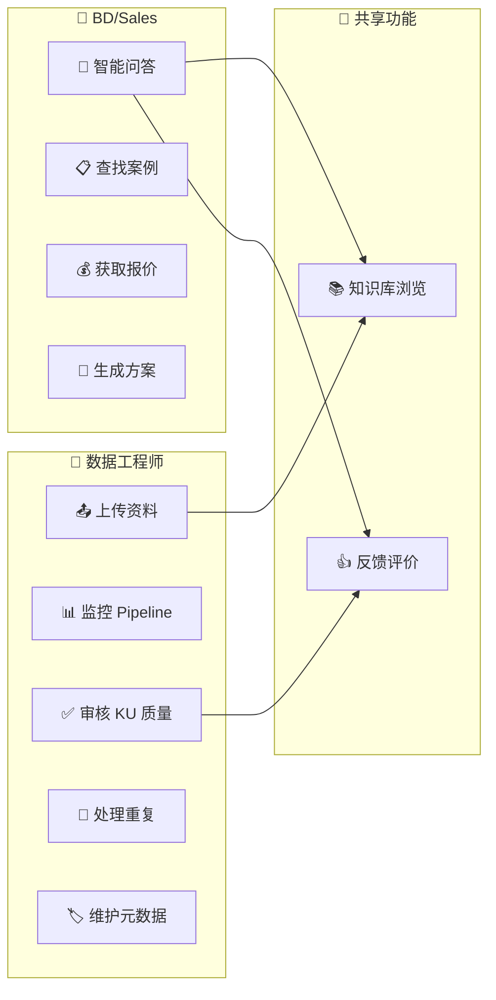

### 界面入口对照

| 功能 | 数据工程师入口 | BD/Sales 入口 |
|------|---------------|---------------|
| 上传资料 | Budibase 上传页 | - |
| 监控 Pipeline | Airflow UI | - |
| 审核 KU | Budibase 审核页 | - |
| 处理重复 | Budibase 去重页 | - |
| 智能问答 | Open WebUI | ✅ Open WebUI |
| 查找案例 | - | Open WebUI (意图识别) |
| 获取报价 | - | Open WebUI (意图识别) |
| 浏览知识库 | Budibase KU 列表 | Open WebUI 附带链接 |
| 反馈评价 | Budibase 报告 | Open WebUI 点赞/踩 |

---

## 🔧 数据工程师旅程

### 场景 1：上传资料

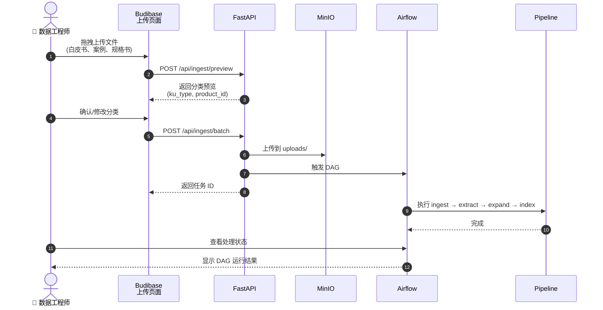

### 场景 2：KU 质量审核

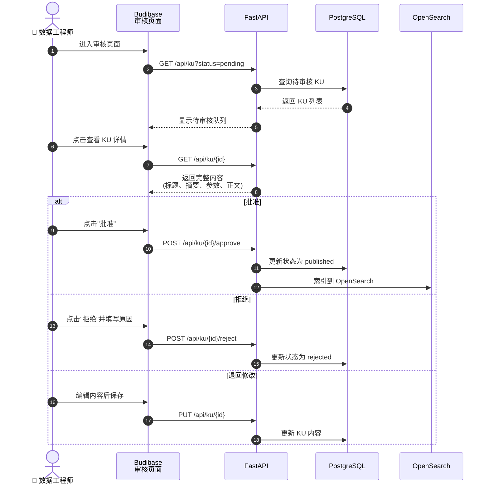

### 场景 3：处理重复 KU

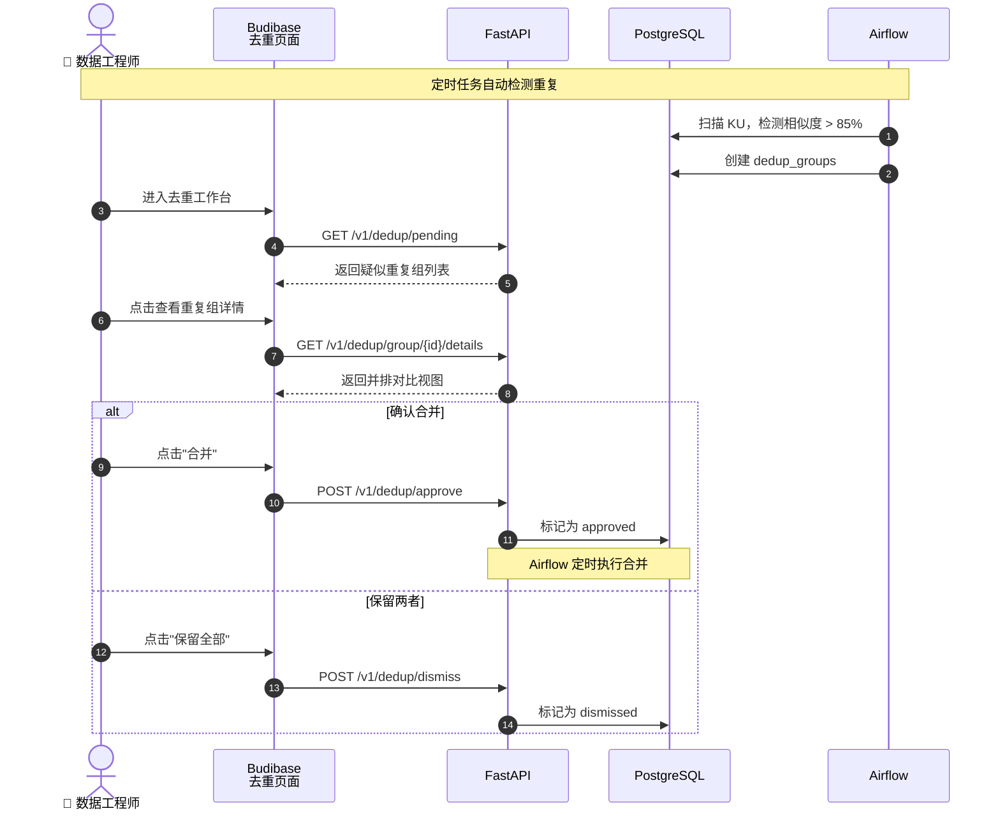

### 场景 4：监控 Pipeline

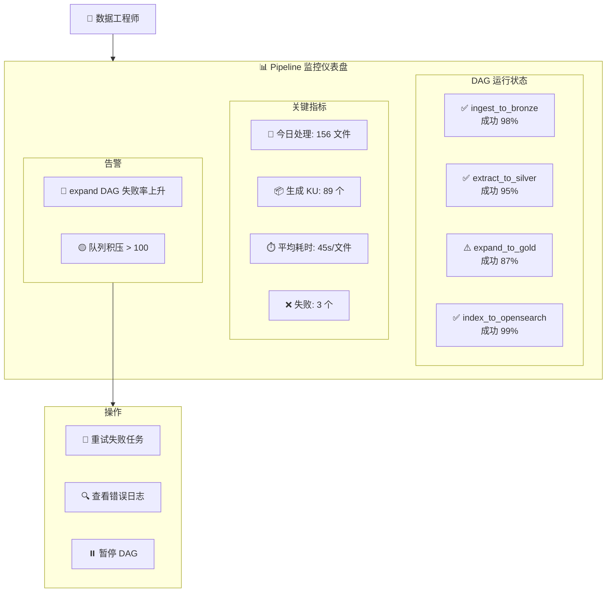

---

## 💼 BD/Sales 旅程

### 场景 1：智能问答

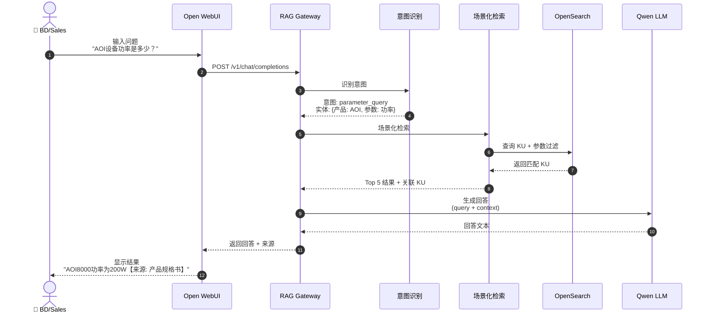

### 场景 2：查找案例

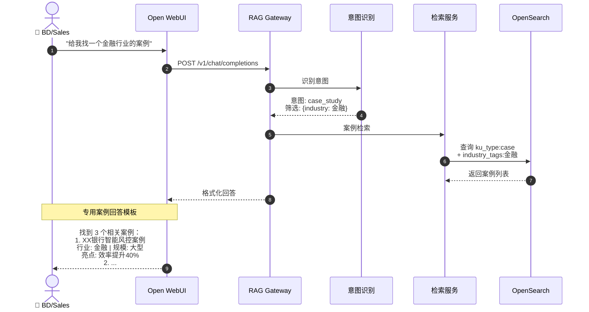

### 场景 3：获取报价

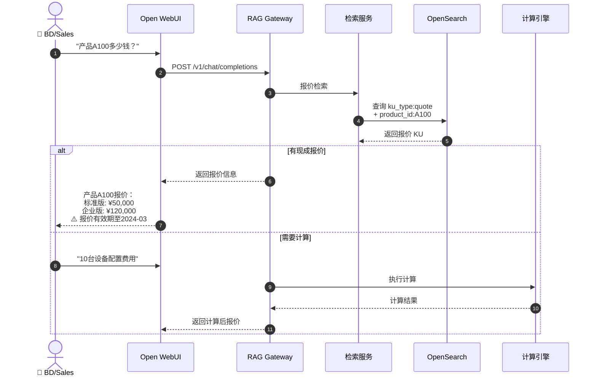

### 场景 4：生成方案

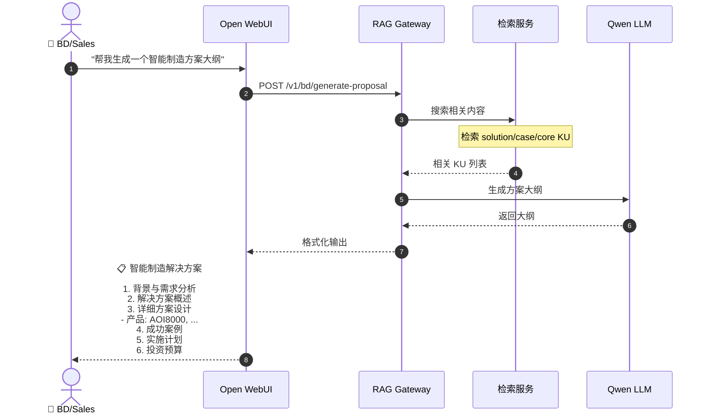

### 快捷命令

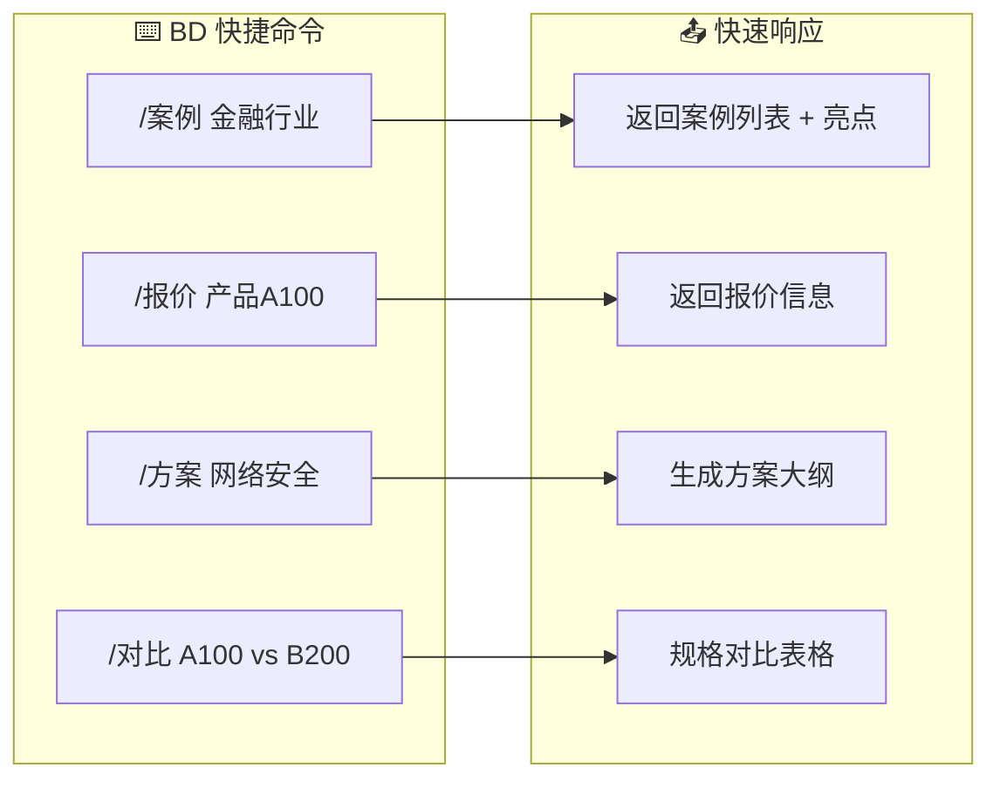

---

## 🔄 数据处理 Pipeline

### 完整数据流

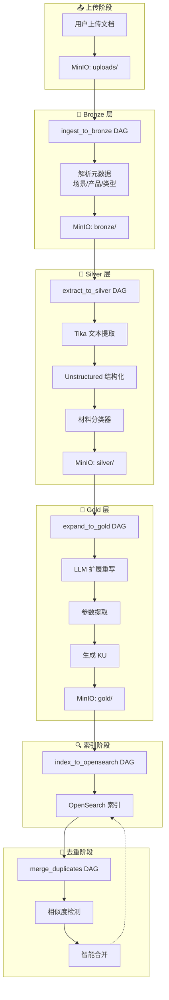

### KU 类型与处理策略

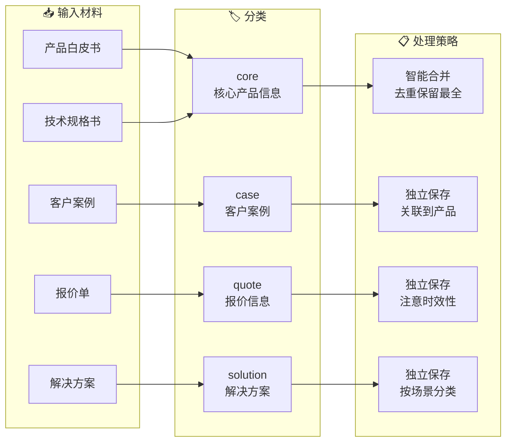

---

## 🚀 一键部署 (阿里云 ECS)

```bash
# 1. SSH 登录 ECS
ssh root@YOUR_ECS_IP

# 2. 下载代码到 /opt/datafactory
mkdir -p /opt/datafactory && cd /opt/datafactory
git clone https://github.com/yourorg/ai-data-factory.git .

# 3. 一键部署
chmod +x deploy.sh
DASHSCOPE_API_KEY=sk-你的百炼Key bash deploy.sh

# 部署完成后访问:
# Chat: http://YOUR_IP:3001
# API:  http://YOUR_IP:8000/docs
```

## 🔧 手动部署

```bash
# 1. 克隆并配置
git clone https://github.com/yourorg/ai-data-factory.git
cd ai-data-factory
cp .env.example .env

# 2. 编辑 .env 配置 API Key
# DASHSCOPE_API_KEY=sk-xxxxx  # 阿里云百炼 API Key

# 3. 启动服务
make init up

# 4. 查看状态
make status
```

---

## 📍 服务访问地址

| 服务 | 地址 | 说明 | 用户角色 |
|------|------|------|----------|
| 💬 Chat (Open WebUI) | http://IP:3001 | AI 对话界面 | BD/Sales |
| 📝 Budibase | http://IP:10000 | 管理后台 | 数据工程师 |
| 🌬️ Airflow | http://IP:8080 | Pipeline 监控 | 数据工程师 |
| 🔧 API Docs | http://IP:8000/docs | FastAPI 文档 | 开发者 |
| 📊 Langfuse | http://IP:3000 | LLM 追踪 | 开发者 |
| 🔄 n8n | http://IP:5678 | 自动化工作流 | 管理员 |
| 💾 MinIO Console | http://IP:9001 | 对象存储 | 管理员 |
| 🔍 OpenSearch | http://IP:9200 | 搜索引擎 | 管理员 |

## 🔑 默认账户

| 服务 | 用户名 | 密码 |
|------|--------|------|
| Airflow | admin | admin123 |
| MinIO | minio | minio123 |
| Budibase | admin@example.com | admin |
| Langfuse | 首次注册创建 | - |
| n8n | 首次注册创建 | - |

---

## 📦 Make 命令

### 基础操作

```bash
make up        # 启动所有服务
make down      # 停止服务
make logs      # 查看日志
make status    # 查看状态
make help      # 查看所有命令
```

### Pipeline 操作

```bash
make pipeline         # 触发完整 Pipeline
make pipeline-ingest  # 仅运行 ingest (uploads → bronze)
make pipeline-extract # 仅运行 extract (bronze → silver)
make pipeline-expand  # 仅运行 expand (silver → gold)
make pipeline-index   # 仅运行 index (gold → OpenSearch)
make trigger-dedup    # 触发重复检测
```

### 升级命令

```bash
make upgrade-phase-a  # 数据模型增强
make upgrade-phase-b  # Pipeline 增强
make upgrade-phase-c  # 检索增强
make upgrade-phase-d  # UI/UX 增强
```

### 验证和调试

```bash
make verify       # 验证 RAG 流程
make smoke        # 健康检查
make buckets      # 查看 MinIO 内容
make index-status # 查看索引状态
make ku-relations # 查看 KU 关系统计
```

---

## 📋 资源需求

推荐配置: 8 vCPU / 16GB RAM
最低配置: 4 vCPU / 8GB RAM (禁用部分服务)

禁用可选服务:
```bash
# 在 .env 中设置
DISABLE_BUDIBASE=1
DISABLE_OPENMETADATA=1
DISABLE_LANGFUSE=1
```

## 🔐 安全说明

- Open WebUI 通过 Nginx 反向代理，可配置 Basic Auth
- API 支持 JWT 认证，角色: `DATA_OPS`, `BD