# 场景化知识问答系统完整设计

## 一、系统整体架构

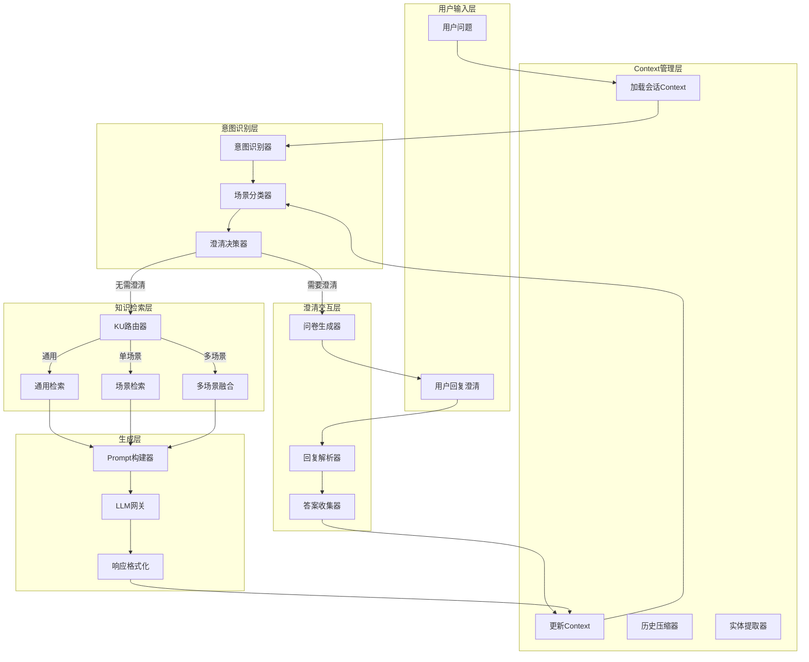

---

## 二、核心模块设计

### 2.1 意图识别模块

**输入**: 用户问题 + 历史Context

**输出**: 意图类型 + 置信度 + 场景分类

#### 意图类型定义

| 意图类型 | 说明 | 典型问法 | 是否需要KU |
|---------|------|---------|-----------|
| solution_recommendation | 方案推荐 | "推荐一个XX方案" | 是 |
| technical_qa | 技术问答 | "XX怎么配置" | 是 |
| troubleshooting | 故障诊断 | "XX报错怎么办" | 是 |
| comparison | 对比分析 | "XX和YY有什么区别" | 是 |
| concept_explain | 概念解释 | "什么是XX" | 是 |
| best_practice | 最佳实践 | "XX有哪些最佳实践" | 是 |
| how_to | 操作指南 | "如何做XX" | 是 |
| general_chat | 闲聊/通用 | "你好"、"谢谢" | 否 |

#### 场景分类逻辑

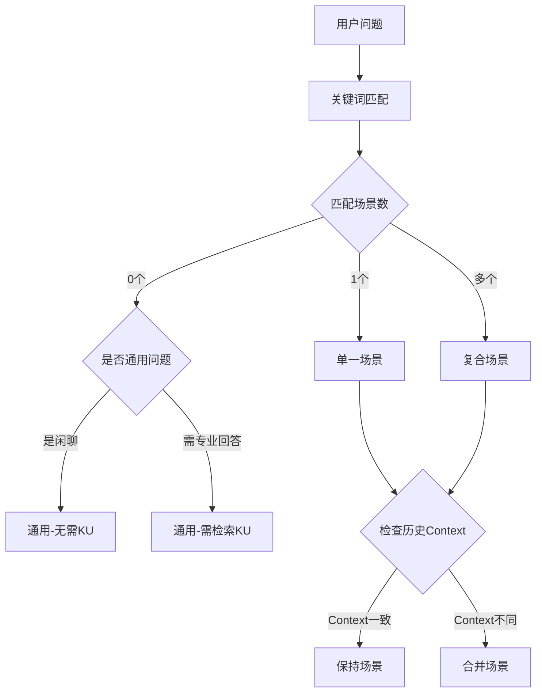

---

### 2.2 澄清交互模块

#### 澄清触发条件

| 条件 | 说明 | 示例 |
|------|------|------|
| 场景模糊 | 匹配到多个场景，无法确定主场景 | "推荐一个安全方案"（网络安全？数据安全？） |
| 信息不足 | 方案推荐类缺少关键上下文 | "推荐一个AOI方案"（产品类型？预算？） |
| 问题过于宽泛 | 问题范围太大，无法给出精准回答 | "怎么做质量检测" |
| 首次交互 | 新用户首次提问复杂问题 | - |

#### Questionnaire 问题类型

| 问题类型 | 格式 | 适用场景 |
|---------|------|---------|
| single_choice | 单选（1-5选一） | 场景选择、规模选择 |
| multi_choice | 多选（可选多个） | 关注维度、需求特征 |
| text | 自由文本 | 补充描述、错误信息 |
| scale | 量表（1-5分） | 优先级评估 |

#### 澄清问题库设计

**按意图分类的标准问题：**

**方案推荐类 (solution_recommendation):**
1. 企业规模/团队规模
2. 预算范围
3. 技术能力水平
4. 实施时间要求
5. 核心痛点（开放式）

**故障诊断类 (troubleshooting):**
1. 具体错误信息/现象
2. 发生时间/频率
3. 最近的变更操作
4. 影响范围
5. 已尝试的解决方法

**对比分析类 (comparison):**
1. 关注的对比维度（成本/性能/易用性等）
2. 应用场景
3. 决策时间点

#### 问卷呈现格式示例

```
🤔 为了给您更精准的建议，请回答以下问题：

**问题1：您的产品类型是？** (必填，回复数字)
1. PCB/电路板
2. 电子元器件
3. 外观件/结构件
4. 其他（请说明）

**问题2：检测的核心需求是？** (可多选，回复数字如"1,3")
1. 焊点质量检测
2. 元器件贴装检测
3. 外观缺陷检测
4. 尺寸测量
5. 其他

**问题3：您的预算和时间要求？** (可选)
请简要说明...

💡 您也可以直接描述您的具体场景，例如：
"我们生产手机主板，需要检测焊点和贴片质量，预算100万左右"
```

#### 用户回复解析策略

| 回复格式 | 解析方式 | 示例 |
|---------|---------|------|
| 纯数字 | 映射到选项 | "1" → 第一个选项 |
| 数字列表 | 多选映射 | "1,3,4" → 选中1、3、4 |
| 自然语言 | LLM提取结构化信息 | "我们是小公司，预算有限" |
| 混合格式 | 组合解析 | "选1，另外预算大概50万" |

---

### 2.3 Context管理模块

#### Context数据结构

| 字段 | 类型 | 说明 |
|------|------|------|
| conversation_id | string | 会话唯一标识 |
| user_id | string | 用户标识 |
| current_intent | IntentType | 当前识别的意图 |
| current_scenarios | List[string] | 当前涉及的场景列表 |
| scene_type | enum | general/single/multi |
| clarification_state | enum | none/pending/collected |
| pending_questions | List[Question] | 待回答的问题 |
| collected_answers | Dict | 已收集的答案 |
| topic_summary | string | 话题摘要（长对话压缩用） |
| key_entities | List[string] | 关键实体（公司名、产品名等） |
| user_preferences | Dict | 用户偏好（预算、技术水平等） |
| messages | List[Message] | 最近N轮对话原文 |
| created_at | datetime | 会话创建时间 |
| updated_at | datetime | 最后更新时间 |

#### Context持久化策略

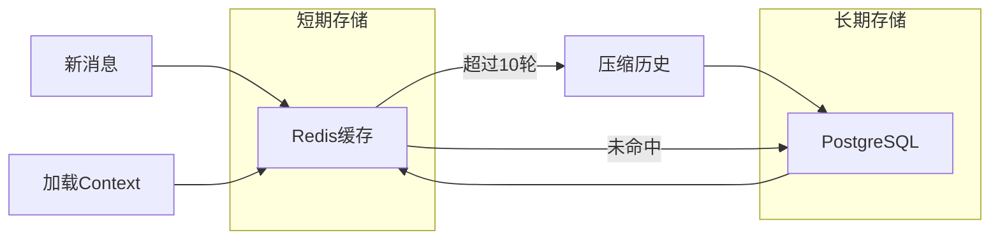

#### 历史压缩机制

**压缩触发条件：** 消息轮次 > 10轮

**压缩策略：**
1. 保留最近5轮原始对话
2. 将旧对话通过LLM压缩为摘要
3. 提取并保留关键实体和用户偏好
4. 摘要格式：`"用户咨询了AOI方案选型，关注PCB焊点检测，预算中等，倾向深度学习方案"`

---

### 2.4 场景化KU管理

#### KU索引结构设计

| 字段 | 类型 | 说明 | 检索权重 |
|------|------|------|---------|
| id | keyword | 文档唯一标识 | - |
| title | text | 标题 | 3.0 |
| summary | text | 摘要 | 2.0 |
| full_text | text | 全文内容 | 1.0 |
| scenario_id | keyword | **主场景ID** | 过滤 |
| scenario_tags | keyword[] | **场景标签（可多个）** | 过滤 |
| solution_id | keyword | 所属解决方案ID | 过滤 |
| intent_types | keyword[] | **适用意图类型** | 加分 |
| material_type | keyword | 材料类型 | - |
| applicability_score | float | **通用性评分(0-1)** | 排序 |
| terms | keyword[] | 关键词/术语 | 1.5 |
| key_points | text | 要点列表 | 1.5 |
| source_file | keyword | 来源文件 | - |
| indexed_at | date | 索引时间 | - |

#### KU场景化标注规则

**上传时自动标注：**
1. 根据上传路径推断场景：`uploads/aoi_inspection/xxx.pdf` → scenario_id = "aoi_inspection"
2. 根据内容关键词补充场景标签
3. 根据文档类型推断适用意图

**人工标注增强：**
1. 通过Budibase管理界面调整场景归属
2. 标注适用的意图类型
3. 设置通用性评分（0=专属某场景，1=完全通用）

#### KU检索路由策略

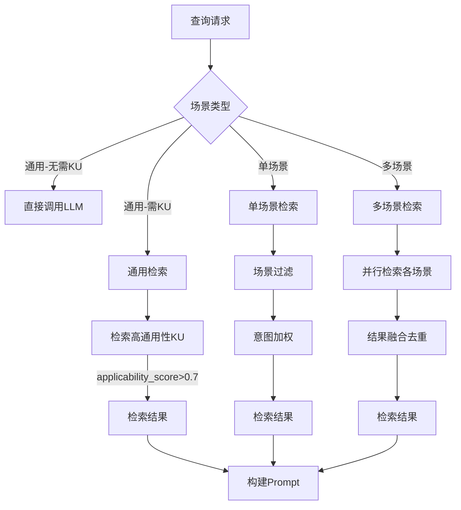

---

### 2.5 Prompt构建模块

#### Prompt模板层级

```
场景 (Scenario)
├── 意图 (Intent)
│   ├── 系统提示词 (System Prompt)
│   ├── Context模板 (Context Template)
│   ├── 输出格式 (Output Format)
│   └── Few-shot示例 (Examples)
```

#### Prompt组装顺序

1. **系统提示词**：角色定义 + 场景专业知识 + 回答规范
2. **用户Context**：用户背景信息 + 已收集的偏好
3. **历史摘要**：之前的对话摘要（如有）
4. **检索内容**：从KU检索到的相关内容
5. **当前问题**：用户本轮的问题
6. **输出引导**：格式要求 + 反馈引导

#### 动态Prompt调整

| 条件 | Prompt调整 |
|------|-----------|
| 首次交互 | 添加欢迎语模板 |
| 澄清后回答 | 强调"根据您提供的信息" |
| 多场景问题 | 添加"从多个角度分析" |
| 无KU命中 | 切换到"通用知识回答"模式 |
| 用户追问 | 引用上轮回答，保持连贯 |

---

## 三、多轮交互流程设计

### 3.1 标准对话流程

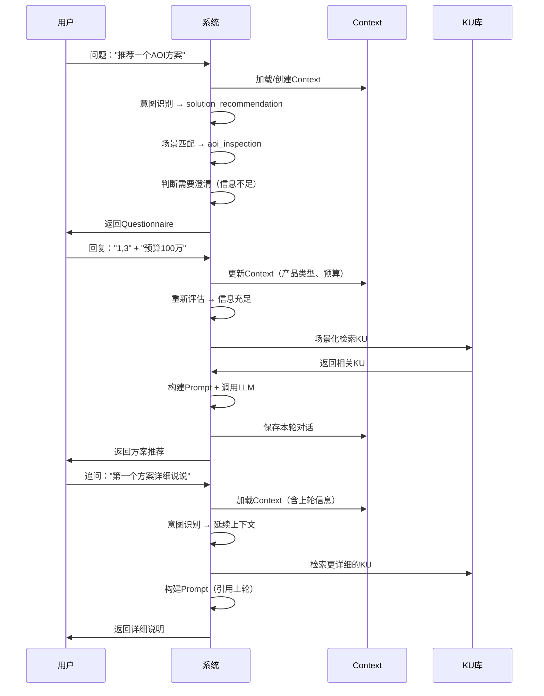

### 3.2 场景切换处理

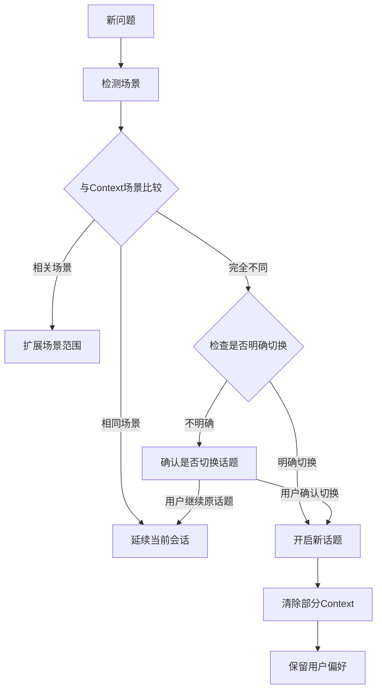

### 3.3 长对话一致性保证

**一致性策略：**

1. **实体追踪**：持续追踪对话中提到的实体（产品名、公司名、技术方案）
2. **偏好记忆**：用户表达的偏好在整个会话中保持（预算、技术水平）
3. **立场一致**：如果推荐了方案A，后续不会无理由改推方案B
4. **引用连贯**：追问时显式引用之前的回答

**Context注入模板：**
```
【对话背景】
{topic_summary}

【用户信息】
- 企业规模: {company_size}
- 预算范围: {budget}
- 技术水平: {tech_level}
- 核心关注: {focus_areas}

【已讨论内容】
- 已推荐方案: {recommended_solutions}
- 用户倾向: {user_preference}

【当前话题】
{current_topic}
```

---

## 四、文件上传与KU生成场景化

### 4.1 上传路径规范

```
uploads/
├── {scenario_id}/                    # 场景目录
│   ├── {solution_id}/                # 解决方案目录
│   │   ├── whitepaper.pdf            # 材料文件
│   │   ├── case_study.docx
│   │   └── metadata.json             # 可选：手动元数据
│   └── general/                      # 场景通用材料
│       └── overview.pdf
└── common/                           # 跨场景通用材料
    └── industry_standards.pdf
```

### 4.2 KU生成Pipeline场景化

```mermaid
flowchart LR
    Upload[文件上传] --> PathParse[解析路径]
    PathParse --> ExtractScenario[提取场景信息]
    
    ExtractScenario --> TextExtract[文本提取]
    TextExtract --> ContentAnalysis[内容分析]
    
    ContentAnalysis --> ScenarioEnrich[场景标签增强]
    ScenarioEnrich --> IntentClassify[意图类型标注]
    IntentClassify --> ApplicabilityScore[通用性评分]
    
    ApplicabilityScore --> KUGenerate[生成KU JSON]
    KUGenerate --> IndexToOS[索引到OpenSearch]
```

### 4.3 自动场景标注逻辑

| 信息来源 | 标注内容 | 优先级 |
|---------|---------|--------|
| 上传路径 | scenario_id, solution_id | 最高 |
| metadata.json | 所有字段 | 高 |
| 文件名关键词 | scenario_tags | 中 |
| 内容关键词分析 | scenario_tags, intent_types | 中 |
| LLM内容理解 | applicability_score, intent_types | 低 |

---

## 五、场景配置管理

### 5.1 场景配置结构

| 配置项 | 说明 |
|--------|------|
| id | 场景唯一标识 |
| name | 场景显示名称 |
| domain | 所属领域 |
| keywords | 匹配关键词列表 |
| synonyms | 同义词映射 |
| intents | 支持的意图类型 |
| clarification_rules | 澄清规则配置 |
| prompt_templates | 各意图的Prompt模板 |
| retrieval_config | 检索配置（加权字段等） |
| priority | 优先级（多场景冲突时） |

### 5.2 场景间关系

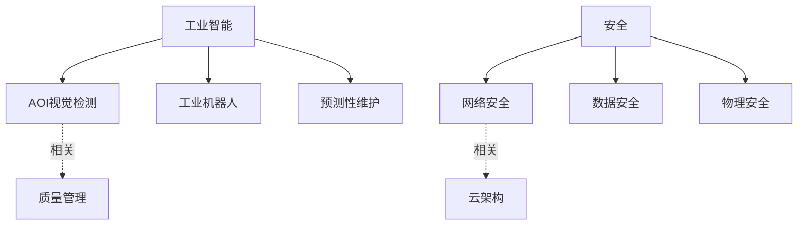

### 5.3 场景优先级规则

当问题匹配多个场景时：

1. **显式提及优先**：用户明确提到的场景关键词
2. **Context延续**：与当前对话Context一致的场景
3. **配置优先级**：场景配置中的priority字段
4. **关键词密度**：匹配关键词数量更多的场景

---

## 六、反馈与优化闭环

### 6.1 反馈收集机制

| 反馈类型 | 收集方式 | 用途 |
|---------|---------|------|
| 显式评分 | 点击满意/不满意 | 直接评估 |
| 自然语言反馈 | 识别"有帮助"/"不满意"等 | 补充评估 |
| 追问行为 | 用户是否追问同一问题 | 隐式不满意信号 |
| 澄清回复质量 | 用户是否正确理解问卷 | 问卷设计评估 |

### 6.2 优化应用

| 反馈数据 | 优化方向 |
|---------|---------|
| 意图识别错误 | 调整意图规则/关键词 |
| 场景匹配错误 | 优化场景关键词 |
| 澄清问题不清晰 | 改进问卷措辞 |
| KU检索不准 | 调整检索权重/标注 |
| 回答不满意 | 优化Prompt模板 |

---

## 七、结构化参数与计算引擎

### 7.1 问题场景分析

在工业和技术场景中，很多问题涉及精确参数查询和计算逻辑，不能仅靠语义检索解决：

| 问题类型 | 示例 | 处理方式 |
|---------|------|---------|
| **精确参数查询** | "功率200W的设备有哪些" | 结构化过滤 |
| **范围参数查询** | "分辨率5μm以下的相机" | 范围匹配 |
| **规格比对** | "这个方案能检测0.1mm的缺陷吗" | 规格校验 |
| **计算推导** | "产能5000片/小时需要几台设备" | 公式计算 |
| **条件组合** | "预算50万，精度0.05mm，速度1秒/件" | 多条件筛选 |

---

### 7.2 结构化参数模型

```
KU / 材料 / 方案
├── 文本内容（用于语义检索）
└── 结构化参数（用于精确查询）
    ├── 性能参数
    │   ├── 检测精度: {value: 0.01, unit: "mm", range: [0.005, 0.05]}
    │   ├── 检测速度: {value: 1000, unit: "pcs/hour"}
    │   └── 功率: {value: 200, unit: "W"}
    ├── 规格参数
    │   ├── 相机分辨率: {value: 5, unit: "μm"}
    │   ├── FOV: {value: 100, unit: "mm", range: [50, 200]}
    │   └── 工作距离: {value: 150, unit: "mm"}
    ├── 商务参数
    │   ├── 价格: {value: 500000, unit: "CNY", range: [300000, 800000]}
    │   ├── 交付周期: {value: 30, unit: "days"}
    │   └── 质保期: {value: 12, unit: "months"}
    └── 适用范围
        ├── 产品尺寸: {min: 10, max: 500, unit: "mm"}
        ├── 缺陷类型: ["焊点", "贴片", "划痕"]
        └── 行业: ["电子", "汽车", "医疗"]
```

---

### 7.3 参数索引设计（OpenSearch扩展）

| 字段 | 类型 | 说明 |
|------|------|------|
| `params` | nested | 结构化参数数组 |
| `params.name` | keyword | 参数名称 |
| `params.value` | float | 数值 |
| `params.unit` | keyword | 单位 |
| `params.min` | float | 最小值（范围型） |
| `params.max` | float | 最大值（范围型） |
| `params.type` | keyword | performance/spec/price/scope |
| `calculated_fields` | object | 预计算字段（如单位成本） |

---

### 7.4 参数提取与识别

**从用户问题中提取参数需求：**

| 用户表达 | 提取结果 |
|---------|---------|
| "功率200W" | `{name: "功率", op: "=", value: 200, unit: "W"}` |
| "精度5μm以下" | `{name: "精度", op: "<=", value: 5, unit: "μm"}` |
| "预算50万左右" | `{name: "价格", op: "range", min: 400000, max: 600000}` |
| "速度要快" | `{name: "速度", op: "sort", order: "desc"}` |
| "产能5000片/小时" | `{name: "产能", op: ">=", value: 5000}` |

**提取模式：**
- **正则规则**：`(\d+\.?\d*)\s*(W|瓦|μm|mm|万|秒|片)`
- **LLM增强**：处理模糊表达（"快"、"便宜"、"高精度"）

---

### 7.5 计算引擎设计

#### 计算类型

| 类型 | 示例 | 公式/逻辑 |
|------|------|----------|
| 产能计算 | "5000片/小时需要几台" | `ceil(需求产能 / 单台产能)` |
| 成本计算 | "检测一片成本多少" | `设备成本 / 使用寿命 / 日产能` |
| 覆盖计算 | "能否检测0.1mm缺陷" | `设备精度 <= 需求精度 * 0.5` |
| 选型推荐 | "满足XX条件的方案" | 多条件过滤 + 加权排序 |

#### 计算规则配置

```yaml
calculation_rules:
  - name: "设备数量估算"
    trigger: ["需要几台", "要多少台", "配置几套"]
    inputs: ["需求产能", "单台产能"]
    formula: "ceil(需求产能 / 单台产能)"
    output_template: "根据您的产能需求{需求产能}，建议配置{result}台设备"
    
  - name: "精度校验"
    trigger: ["能否检测", "能不能看到", "检得出吗"]
    inputs: ["设备精度", "缺陷尺寸"]
    formula: "设备精度 <= 缺陷尺寸 * 0.3"
    output_template: 
      true: "可以检测，设备精度{设备精度}满足{缺陷尺寸}的检测需求"
      false: "无法可靠检测，建议选择精度更高的设备"
      
  - name: "ROI计算"
    trigger: ["投资回报", "多久回本", "ROI"]
    inputs: ["设备成本", "节省人力成本", "良率提升收益"]
    formula: "设备成本 / (节省人力成本 + 良率提升收益)"
    output_template: "预计投资回报周期约{result}个月"
```

---

### 7.6 混合检索策略

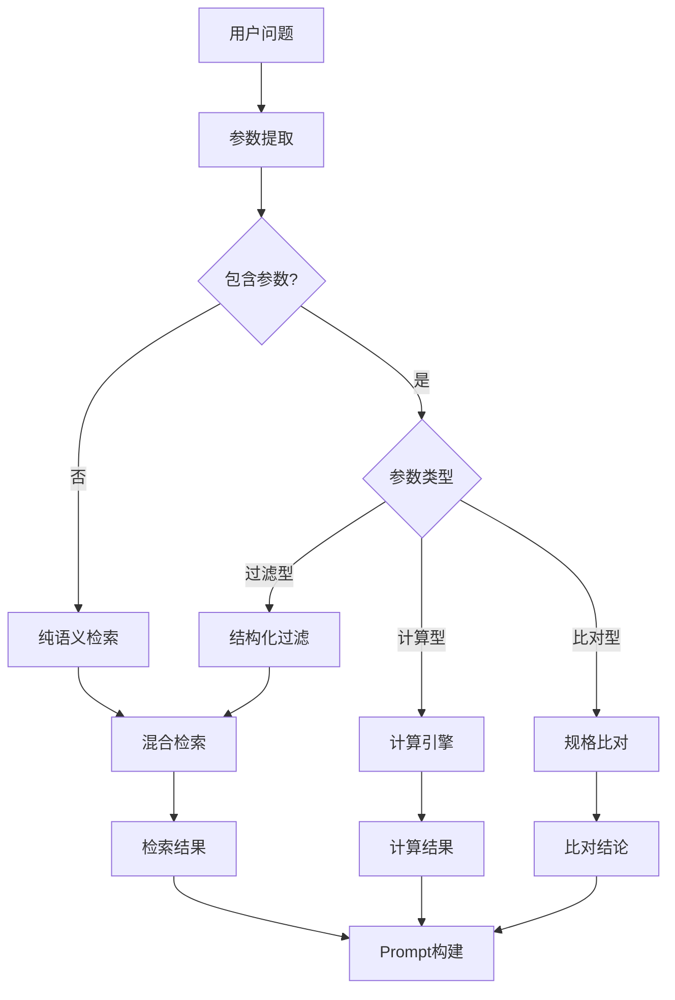

---

### 7.7 参数来源与标注

#### 自动提取（Pipeline增强）

1. 从PDF/文档中提取规格表
2. 使用LLM结构化抽取参数
3. 正则匹配数值+单位组合

#### 手动标注（Budibase管理）

1. 方案/材料的关键参数录入
2. 参数单位标准化
3. 有效范围设定

#### 参数继承规则

```
场景 (Scenario)
└── 通用参数定义（可选参数列表）

方案 (Solution)
└── 方案级参数（典型值/范围）

材料 (Material)
└── 具体参数（精确值）
```

---

### 7.8 典型问答示例

**示例1：参数过滤**
```
用户：推荐一个精度0.01mm以下、价格50万以内的AOI设备

系统处理：
1. 参数提取：精度<=0.01mm, 价格<=500000
2. 结构化过滤：筛选满足条件的方案
3. 语义检索：补充相关材料
4. 生成回答：列出符合条件的方案+对比
```

**示例2：计算推导**
```
用户：我们产线产能10000片/小时，一套AOI能满足吗

系统处理：
1. 识别计算意图
2. 查询AOI标准产能（如3000片/小时）
3. 计算：10000/3000 = 3.33 → 需要4台
4. 生成回答：建议配置4台，并说明计算依据
```

**示例3：规格比对**
```
用户：这个方案能检测0402元器件的焊点吗

系统处理：
1. 查询方案的检测能力参数
2. 查询0402元器件规格（1.0mm x 0.5mm）
3. 比对：检测精度 vs 元器件尺寸
4. 生成回答：是/否 + 依据
```

---

## 八、数据处理 Pipeline 增强

为支持场景化问答、结构化参数检索等功能，现有数据处理 Pipeline 需要进行增强。

### 8.1 现有 Pipeline 与目标差距

#### 现有流程


#### 字段差距分析

| 字段 | 现有状态 | 设计需求 | 说明 |
|------|---------|---------|------|
| title | 有 | 有 | - |
| summary | 有 | 有 | - |
| key_points | 有 | 有 | - |
| terms | 有 | 有 | - |
| full_text | 有 | 有 | - |
| **scenario_id** | 缺失 | 需要 | 从上传路径提取 |
| **scenario_tags** | 缺失 | 需要 | 多场景标签 |
| **solution_id** | 缺失 | 需要 | 解决方案归属 |
| **intent_types** | 缺失 | 需要 | 适用意图类型 |
| **applicability_score** | 缺失 | 需要 | 通用性评分(0-1) |
| **params** | 缺失 | 需要 | 结构化参数 |
| **material_type** | 缺失 | 需要 | 材料类型 |

---

### 8.2 场景元数据提取（Ingest阶段增强）

**问题：** 当前 `ingest_to_bronze` 只复制文件，未解析上传路径中的场景信息。

**增强方案：**

```
上传路径：uploads/aoi_inspection/pcb_detection/spec.pdf
          ↓ 解析
元数据：{
  "scenario_id": "aoi_inspection",
  "solution_id": "pcb_detection",
  "original_path": "aoi_inspection/pcb_detection/spec.pdf",
  "filename": "spec.pdf"
}
```

**存储位置：** `bronze/metadata/{filename}.json`

**路径解析规则：**

| 路径层级 | 解析结果 |
|---------|---------|
| `uploads/{scenario}/{solution}/{file}` | scenario_id, solution_id |
| `uploads/{scenario}/general/{file}` | scenario_id, solution_id="general" |
| `uploads/common/{file}` | scenario_id="common", applicability_score=1.0 |
| `uploads/{file}` | scenario_id=null, 需LLM推断 |

---

### 8.3 结构化参数提取（新增DAG）

**新增DAG：** `extract_params_to_silver`

**触发时机：** extract_to_silver 之后

**提取流程：**

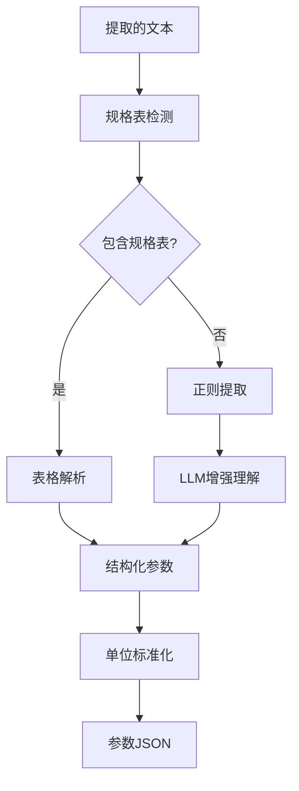

**正则提取模式：**

```python
PARAM_PATTERNS = [
    # 数值+单位
    r'(\d+\.?\d*)\s*(W|瓦|kW|千瓦)',           # 功率
    r'(\d+\.?\d*)\s*(μm|um|微米|mm|毫米)',    # 精度/尺寸
    r'(\d+\.?\d*)\s*(片/小时|pcs/h|UPH)',     # 产能
    r'(\d+\.?\d*)\s*(万|万元|元|CNY|RMB)',    # 价格
    r'(\d+\.?\d*)\s*(秒|s|ms|毫秒)',          # 时间
    # 范围表达
    r'(\d+\.?\d*)\s*[-~]\s*(\d+\.?\d*)\s*(.*?)',  # 范围值
]
```

**输出格式：**

```json
{
  "params": [
    {"name": "检测精度", "value": 0.01, "unit": "mm", "type": "performance"},
    {"name": "检测速度", "value": 3000, "unit": "pcs/hour", "type": "performance"},
    {"name": "功率", "value": 200, "unit": "W", "type": "spec"},
    {"name": "价格", "min": 400000, "max": 600000, "unit": "CNY", "type": "price"}
  ]
}
```

---

### 8.4 场景化KU生成（Expand阶段增强）

**修改DAG：** `expand_and_rewrite_to_gold`

**增强Prompt：**

```
你是一个知识工程师。请将以下文本转换为结构化的知识单元。

【文件元数据】
- 场景ID: {scenario_id}
- 解决方案ID: {solution_id}
- 文件名: {filename}

【已提取参数】
{extracted_params}

【要求】
1. 生成标题、摘要、关键要点、术语
2. 根据内容补充场景标签（scenario_tags）
3. 判断适用的意图类型（intent_types）
4. 评估通用性（applicability_score: 0-1）
5. 识别材料类型（material_type）
6. 整合结构化参数

【输出JSON格式】
{
  "title": "...",
  "summary": "...",
  "key_points": [...],
  "terms": [...],
  "full_text": "...",
  "scenario_id": "...",
  "scenario_tags": [...],
  "solution_id": "...",
  "intent_types": [...],
  "applicability_score": 0.8,
  "material_type": "...",
  "params": [...]
}
```

---

### 8.5 材料类型自动识别

**识别规则：**

| 特征 | 材料类型 | 说明 |
|------|---------|------|
| 文件名含 "白皮书/whitepaper" | whitepaper | 技术白皮书 |
| 文件名含 "案例/case" | case_study | 客户案例 |
| 内容含 "步骤/操作指南/如何" | tutorial | 操作教程 |
| 内容含 "常见问题/FAQ/Q&A" | faq | 常见问题 |
| 内容含 "对比/比较/vs" | comparison | 对比分析 |
| 内容含 "架构图/部署图/拓扑" | architecture | 架构文档 |
| 内容含 "规格/参数/型号" | datasheet | 产品规格 |
| 内容含 "故障/排错/troubleshoot" | troubleshooting | 故障排除 |
| 默认 | general | 通用文档 |

**意图类型推断规则：**

| 材料类型 | 推断的意图类型 |
|---------|---------------|
| whitepaper | solution_recommendation, concept_explain |
| case_study | solution_recommendation, best_practice |
| tutorial | how_to, technical_qa |
| faq | troubleshooting, technical_qa |
| comparison | comparison |
| datasheet | technical_qa, comparison |
| troubleshooting | troubleshooting |

---

### 8.6 OpenSearch索引字段扩展

**修改脚本：** `scripts/create_opensearch_index.py`

**新增Mapping：**

```json
{
  "mappings": {
    "properties": {
      "id": {"type": "keyword"},
      "title": {"type": "text", "analyzer": "ik_max_word"},
      "summary": {"type": "text", "analyzer": "ik_max_word"},
      "full_text": {"type": "text", "analyzer": "ik_max_word"},
      "key_points": {"type": "text", "analyzer": "ik_max_word"},
      "terms": {"type": "keyword"},
      "source_file": {"type": "keyword"},
      "indexed_at": {"type": "date"},
      
      "scenario_id": {"type": "keyword"},
      "scenario_tags": {"type": "keyword"},
      "solution_id": {"type": "keyword"},
      "intent_types": {"type": "keyword"},
      "applicability_score": {"type": "float"},
      "material_type": {"type": "keyword"},
      
      "params": {
        "type": "nested",
        "properties": {
          "name": {"type": "keyword"},
          "value": {"type": "float"},
          "unit": {"type": "keyword"},
          "min": {"type": "float"},
          "max": {"type": "float"},
          "type": {"type": "keyword"}
        }
      }
    }
  }
}
```

---

### 8.7 完整增强后Pipeline流程

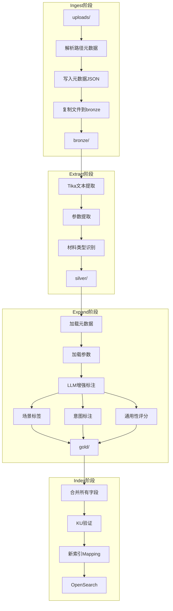

---

### 8.8 Pipeline DAG文件清单

| 操作 | 文件路径 | 说明 |
|------|---------|------|
| 修改 | `services/airflow/dags/ingest_to_bronze.py` | 添加路径解析和元数据写入 |
| 新建 | `services/airflow/dags/extract_params.py` | 结构化参数提取DAG |
| 修改 | `services/airflow/dags/extract_to_silver.py` | 添加材料类型识别 |
| 修改 | `services/airflow/dags/expand_and_rewrite_to_gold.py` | 增强Prompt，添加场景/意图/评分 |
| 修改 | `services/airflow/dags/index_to_opensearch.py` | 新增索引字段 |
| 修改 | `scripts/create_opensearch_index.py` | 新索引结构 |
| 新建 | `services/pipeline/pipeline/param_patterns.py` | 参数提取正则规则 |
| 新建 | `services/pipeline/pipeline/material_classifier.py` | 材料类型分类器 |

---

## 九、实现优先级与模块分解

### 第零阶段：Pipeline基础设施（前置）

**目标：** 为场景化问答提供数据基础

1. 修改 `ingest_to_bronze.py` - 添加路径解析和元数据写入
2. 新建 `extract_params.py` - 结构化参数提取DAG
3. 修改 `extract_to_silver.py` - 添加材料类型识别
4. 修改 `expand_and_rewrite_to_gold.py` - 增强Prompt，添加场景/意图/评分
5. 修改 `index_to_opensearch.py` - 新增索引字段
6. 更新 `scripts/create_opensearch_index.py` - 新索引结构
7. 新建 `pipeline/param_patterns.py` - 参数提取正则规则
8. 新建 `pipeline/material_classifier.py` - 材料类型分类器

### 第一阶段：核心功能

**目标：** 实现基本的场景化问答能力

1. 增强的意图识别（规则+LLM混合）
2. 场景分类（通用/单一/多场景）
3. 基础Questionnaire（3-5个标准问题）
4. KU场景化索引字段
5. 场景化检索路由

### 第二阶段：Context增强

**目标：** 支持多轮对话和上下文连贯

1. 会话Context持久化（Redis+Postgres）
2. 历史压缩机制
3. 实体提取与追踪
4. 话题摘要生成

### 第三阶段：结构化参数

**目标：** 支持精确参数查询和计算

1. 参数提取器（从问题中提取参数需求）
2. 结构化检索（参数过滤+语义混合）
3. 计算引擎（公式计算+规格比对）
4. 参数标注Pipeline（从文档自动提取参数）

### 第四阶段：优化闭环

**目标：** 持续优化问答质量

1. 场景切换检测与处理
2. 反馈收集与分析
3. 自动优化规则调整

### 实施依赖关系

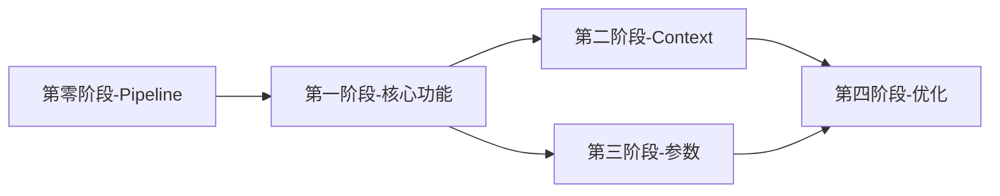

---

## 十、模块化文件清单

### 10.1 Pipeline层（第零阶段）

| 操作 | 文件路径 | 说明 |
|------|---------|------|
| 修改 | `services/airflow/dags/ingest_to_bronze.py` | 添加路径解析和元数据写入 |
| 新建 | `services/airflow/dags/extract_params.py` | 结构化参数提取DAG |
| 修改 | `services/airflow/dags/extract_to_silver.py` | 添加材料类型识别 |
| 修改 | `services/airflow/dags/expand_and_rewrite_to_gold.py` | 增强Prompt，添加场景/意图/评分 |
| 修改 | `services/airflow/dags/index_to_opensearch.py` | 新增索引字段，场景+参数标注 |
| 修改 | `scripts/create_opensearch_index.py` | 新索引结构，增加场景化字段 |
| 新建 | `services/pipeline/pipeline/param_patterns.py` | 参数提取正则规则库 |
| 新建 | `services/pipeline/pipeline/material_classifier.py` | 材料类型分类器 |
| 新建 | `services/pipeline/pipeline/metadata_parser.py` | 路径元数据解析器 |

### 10.2 API服务层（第一~四阶段）

| 操作 | 文件路径 | 说明 |
|------|---------|------|
| 新建 | `services/api/app/services/intent_recognizer.py` | 增强意图识别 |
| 新建 | `services/api/app/services/clarification.py` | Questionnaire引擎 |
| 新建 | `services/api/app/services/response_parser.py` | 回复解析 |
| 新建 | `services/api/app/services/context_store.py` | Context持久化 |
| 新建 | `services/api/app/services/history_compressor.py` | 历史压缩 |
| 新建 | `services/api/app/services/entity_extractor.py` | 实体提取 |
| 新建 | `services/api/app/services/topic_tracker.py` | 话题追踪 |
| 新建 | `services/api/app/services/param_extractor.py` | 参数提取器（从用户问题提取） |
| 新建 | `services/api/app/services/calc_engine.py` | 计算引擎 |
| 新建 | `services/api/app/services/structured_search.py` | 结构化检索 |
| 修改 | `services/api/app/services/retrieval.py` | 场景化检索增强 |
| 修改 | `services/api/app/services/feedback_optimizer.py` | 反馈优化增强 |
| 修改 | `services/api/app/api/gateway.py` | 集成新模块 |

### 10.3 数据库迁移

| 操作 | 文件路径 | 说明 |
|------|---------|------|
| 新建 | `services/api/alembic/versions/xxx_add_context_tables.py` | Context表迁移 |
| 新建 | `services/api/alembic/versions/xxx_add_calculation_rules.py` | 计算规则表迁移 |
| 新建 | `services/api/alembic/versions/xxx_add_param_definitions.py` | 参数定义表迁移 |

---

## 十一、数据库Schema扩展

```sql
-- 会话Context持久化
CREATE TABLE conversation_contexts (
    id VARCHAR(64) PRIMARY KEY,
    user_id VARCHAR(64),
    current_intent VARCHAR(50),
    current_scenarios JSONB,
    scene_type VARCHAR(20),
    clarification_state VARCHAR(20),
    collected_answers JSONB,
    topic_summary TEXT,
    key_entities JSONB,
    user_preferences JSONB,
    extracted_params JSONB,           -- 提取的参数需求
    messages JSONB,
    created_at TIMESTAMP DEFAULT NOW(),
    updated_at TIMESTAMP DEFAULT NOW()
);

-- 反馈记录
CREATE TABLE conversation_feedbacks (
    id VARCHAR(64) PRIMARY KEY,
    conversation_id VARCHAR(64),
    message_id VARCHAR(64),
    feedback_type VARCHAR(20),
    rating INTEGER,
    comment TEXT,
    intent_type VARCHAR(50),
    scenario_id VARCHAR(64),
    created_at TIMESTAMP DEFAULT NOW()
);

-- 计算规则配置
CREATE TABLE calculation_rules (
    id VARCHAR(64) PRIMARY KEY,
    name VARCHAR(200) NOT NULL,
    scenario_id VARCHAR(64),
    trigger_patterns JSONB,           -- 触发关键词
    inputs JSONB,                      -- 输入参数定义
    formula TEXT,                      -- 计算公式
    output_template JSONB,             -- 输出模板
    enabled BOOLEAN DEFAULT TRUE,
    created_at TIMESTAMP DEFAULT NOW()
);

-- 参数标准定义
CREATE TABLE parameter_definitions (
    id VARCHAR(64) PRIMARY KEY,
    scenario_id VARCHAR(64),
    name VARCHAR(100) NOT NULL,        -- 参数名称
    display_name VARCHAR(200),         -- 显示名称
    unit VARCHAR(50),                  -- 标准单位
    param_type VARCHAR(50),            -- performance/spec/price/scope
    value_type VARCHAR(20),            -- number/range/enum
    enum_values JSONB,                 -- 枚举值列表
    default_range JSONB,               -- 默认范围
    description TEXT,
    created_at TIMESTAMP DEFAULT NOW()
);
```